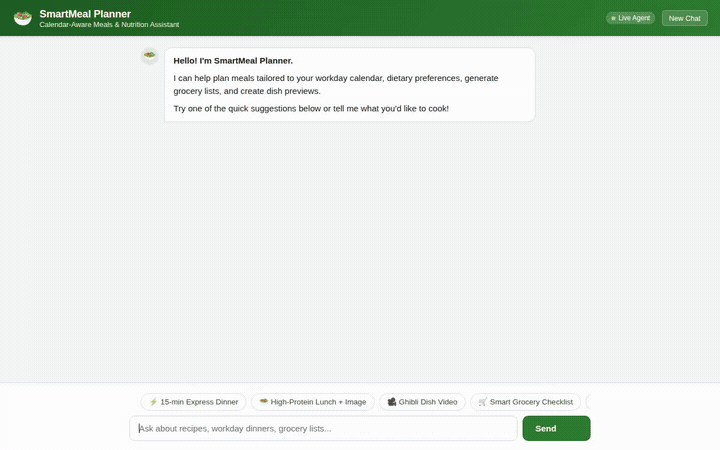

# 🥗 SmartMeal Planner

> An intelligent, agentic meal-planning assistant powered by **Google Gemini**, **Agent Development Kit (ADK)**, and **Google Cloud**. It adapts to busy daily schedules, curates healthy recipes from pantry staples, computes nutritional macros, and generates animated Studio Ghibli dish previews.

<div align="center">



*Screen recording of SmartMeal Planner in action: Firestore recipe search, A2UI card rendering, and Google Omni video generation with Lyria instrumental soundtrack.*

</div>

---

## 📖 Overview

**SmartMeal Planner** helps remote professionals eat healthier without spending hours planning or cooking. By combining conversational reasoning with real-time cloud data and multimodal generation, the agent:
- Understands ingredient availability and dietary constraints (e.g. quick <20m dinners, high protein, low sodium).
- Queries a curated **Cloud Firestore** database for grounded recipe steps and ingredients.
- Persists user preferences and dietary habits across conversations with **Vertex AI Memory Bank**.
- Accurately computes calories, macronutrient splits, and micronutrient totals.
- Generates photorealistic dish photography (**Imagen 3**) and animated cooking video previews (**Google Omni** `gemini-omni-flash-preview`).
- Renders responsive **A2UI** interactive recipe cards and streams replies over the **A2A** protocol.

---

## 🏗️ Architecture & Google Cloud Services

SmartMeal Planner is built entirely on Google Cloud's agentic stack:

| Component | Technology | Purpose |
| :--- | :--- | :--- |
| **Agent Reasoning Engine** | **Google ADK** & **Vertex AI Agent Runtime** | Core ReAct agent loop orchestrated via `agents-cli` on Gemini models |
| **Long-Term Memory** | **Vertex AI Memory Bank** | Cross-session memory recalling dietary preferences, allergies, and kitchen equipment |
| **Structured Database** | **Cloud Firestore** | Stores indexed recipes (`recipes` collection) and user favorites (`user_favorites`) |
| **Media Storage** | **Google Cloud Storage** | Dedicated public media bucket hosting generated recipe images and MP4 preview clips |
| **Image Generation** | **Imagen 3** (`imagen-3.0-generate-002`) | Creates high-definition dish presentation photography |
| **Video Generation** | **Google Omni** (`gemini-omni-flash-preview`) | Generates animated culinary videos with motion and atmosphere |
| **Rich Card UI** | **A2UI** (`after_model_callbacks`) | Emits declarative cards for ingredients, timing badges, and macro charts |
| **Web Frontend** | **FastAPI** + **Cloud Run** | Lightweight asynchronous web proxy and responsive chat interface communicating via A2A SSE |

---

## 🛠️ Implemented Agent Tools

The agent's capabilities are implemented in Python in [`app/tools.py`](smart-meal-planner/app/tools.py) and registered with the root agent in [`app/agent.py`](smart-meal-planner/app/agent.py):

- **`query_recipes`**: Searches Firestore for dishes matching dietary tags, maximum preparation/cook times, and available pantry items.
- **`save_favorite_recipe`**: Persists bookmarked recipes and custom notes into the user's Firestore profile.
- **`calculate_meal_nutrition`**: Computes calorie counts, macronutrient distribution (protein, carbohydrates, healthy fats), and key micronutrients.
- **`generate_dish_image`**: Invokes Imagen 3 on Vertex AI to produce photo previews of planned dishes, uploading assets directly to Cloud Storage.
- **`generate_dish_video`**: Calls Google Omni in the global region to generate animated cooking previews, saving them as agent artifacts and returning streaming URLs.
- **`PreloadMemoryTool` & Memory Callback**: Automatically retrieves past memories at session start and synthesizes new user preferences at turn completion.

### 📌 Planned / Future Enhancements
*(Marked as planned, not yet implemented)*:
- **Google Calendar Integration**: Auto-detecting busy calendar days to dynamically suggest 15-minute express recipes on meeting-heavy days.
- **Barcode & Receipt Scanning**: Vision-based pantry inventory ingestion from store receipts.

---

## 🚀 Running the Project Locally

Follow these instructions to run the agent and frontend on your local development machine.

### Prerequisites

- Python 3.11+
- [uv](https://docs.astral.sh/uv/) package manager
- [Google Cloud SDK (`gcloud`)](https://cloud.google.com/sdk/docs/install) authenticated to your GCP project:
  ```bash
  gcloud auth login
  gcloud auth application-default login
  gcloud config set project <YOUR_GCP_PROJECT_ID>
  ```
- Google Agents CLI:
  ```bash
  uv tool install google-agents-cli
  ```

### 1. Launch the Agent Backend

Navigate to the agent directory and install dependencies:

```bash
cd smart-meal-planner
agents-cli install
```

Launch the interactive local development playground:

```bash
agents-cli playground
```

The ADK development playground will start locally, allowing you to inspect tool calls, session state, and memory traces.

### 2. Run the Custom Web Frontend

In a separate terminal, navigate to the frontend folder and install requirements:

```bash
cd frontend
pip install -r requirements.txt
```

Set the agent environment variables (pointing to your deployed Agent Runtime resource or local runner):

```bash
export AGENT_ENGINE_RESOURCE_NAME="projects/<PROJECT_NUMBER>/locations/<REGION>/reasoningEngines/<RESOURCE_ID>"
export AGENT_DIRECTORY="app"
python main.py
```

The web server will start locally and serve the chat interface with full A2UI card support, instant prompt chips, and video streaming.

### 3. Run Automated Tests

Run unit and integration tests with `pytest`:

```bash
cd smart-meal-planner
uv run pytest tests/unit tests/integration
```

---

## 📊 Quality & Evaluation

SmartMeal Planner includes automated evaluation datasets and metrics for tracking agent quality:
- Multi-turn evaluation dataset in `tests/eval/datasets/`.
- Evaluated against task completion, tool selection accuracy, and grounded response metrics using the `agents-cli eval` suite.
